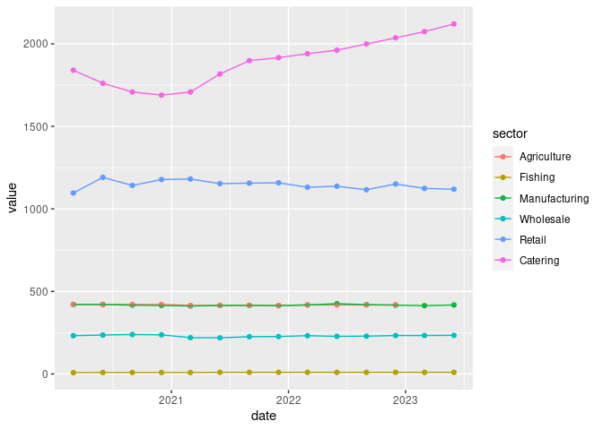

<!-- README.md is generated from README.Rmd. Please edit that file -->

# fsp

<!-- badges: start -->
<!-- badges: end -->

Experimental functions to assist with producing the Food Statistics
Pocketbook

## Installation

You can install the development version of fsp from
[GitHub](https://github.com/) with:

``` r
# install.packages("devtools")
devtools::install_github("FoodchainStats/fsp")
```

## JOBS03 workflow

``` r
library(fsp)

j <- acquire_jobs03()

jobs03 <- get_jobs03_data(j)

knitr::kable(head(jobs03))
```

| date       | sic_section | sic_division | industry                                                           | value |
|:-----------|:------------|:-------------|:-------------------------------------------------------------------|------:|
| 1996-03-01 | A           | 01           | Crop and animal production, hunting and related service activities |   204 |
| 1996-06-01 | A           | 01           | Crop and animal production, hunting and related service activities |   217 |
| 1996-09-01 | A           | 01           | Crop and animal production, hunting and related service activities |   239 |
| 1996-12-01 | A           | 01           | Crop and animal production, hunting and related service activities |   226 |
| 1997-03-01 | A           | 01           | Crop and animal production, hunting and related service activities |   222 |
| 1997-06-01 | A           | 01           | Crop and animal production, hunting and related service activities |   246 |

## Agricultural workforce

``` r
library(fsp)
w <- acquire_ag_workforce()

ag_workforce <- fsp::get_ag_workforce(w)

knitr::kable(head(ag_workforce))
```

| year | country | category                                                          |  value |
|:-----|:--------|:------------------------------------------------------------------|-------:|
| 2015 | England | Total labour force (incl. farmers and spouses)                    | 304796 |
| 2015 | England | Farmers, business partners, directors and spouses                 | 173963 |
| 2015 | England | Farmers, business partners, directors and spouses - Full time     |  89954 |
| 2015 | England | Farmers, business partners, directors and spouses - Part time (a) |  84009 |
| 2015 | England | Regular employees, salaried managers and - Part time (a)          | 130833 |
| 2015 | England | Regular employees, salaried managers and - Regular employees (c)  |  85894 |

## Process

``` r

lvls <- c("Agriculture",
          "Fishing",
          "Manufacturing",
          "Wholesale",
          "Retail",
          "Catering")

ag_gb <- fsp::compile_ag_workforce()

food <- fsp::jobs03_sectors() |> 
  dplyr::left_join(fsp::get_jobs03_data()) |> 
  dplyr::group_by(sector, date) |> 
  dplyr::summarise(value = sum(value)) |> 
  dplyr::bind_rows(ag_gb) |> 
  dplyr::mutate(sector = forcats::fct(sector, levels = lvls))


food |> 
  dplyr::filter(date >= "2020-01-01") |> 
  ggplot2::ggplot() +
  ggplot2::geom_point(ggplot2::aes(x = date, y = value, colour = sector)) +
  ggplot2::geom_line(ggplot2::aes(x = date, y = value, colour = sector))
```



``` r


food |>
  dplyr::group_by(sector) |>
  dplyr::slice_max(date) |> 
  knitr::kable()
```

| sector        | date       |    value |
|:--------------|:-----------|---------:|
| Agriculture   | 2022-12-01 |  418.429 |
| Fishing       | 2023-06-01 |   10.000 |
| Manufacturing | 2023-06-01 |  418.000 |
| Wholesale     | 2023-06-01 |  234.000 |
| Retail        | 2023-06-01 | 1119.000 |
| Catering      | 2023-06-01 | 2120.000 |
